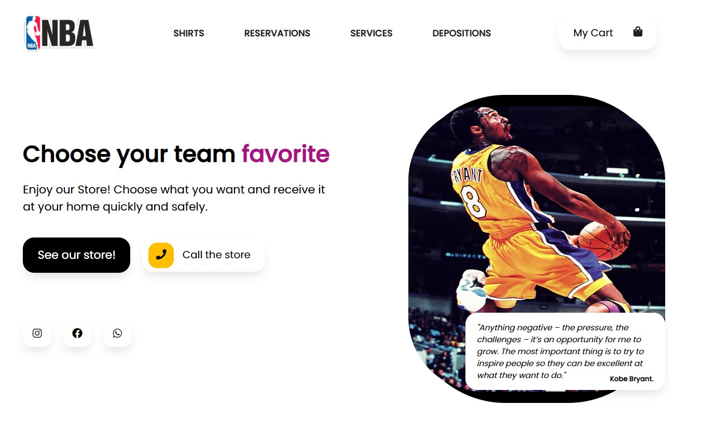

<h1 align="center"> Store NBA </h1>

Projeto Web ded uma loja da NBA fictícia.

  <a href="#-tecnologias">Tecnologias</a>&nbsp;&nbsp;&nbsp;|&nbsp;&nbsp;&nbsp;
  <a href="#-projeto">Projeto</a>&nbsp;&nbsp;&nbsp;&nbsp;&nbsp;&nbsp;  

  

## 🚀 Tecnologias

Esse projeto foi desenvolvido com as seguintes tecnologias:

- HTML5 e CSS3;
- JavaScript;
- Git e Github;

## 💻 Projeto

A store é um projeto que mostra a flexibilidade para pessoas que buscam mais facilidade e eficiência em um site, tornando assim os pedido e solicitações mais ágeis e precisa através de uma store e carrinho onde consegue manipular suas compras, enviando assim toda as descrições do pedido e endereço, tudo atualizado via WhatsApp diretamente para a loja.

Desenvoldido por: [Wagner Ferreira](https://www.instagram.com/wagnerffadm/)
